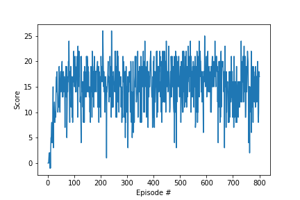

# Udacity DRLND Project 1 Navigation

## Learning Algorithm

The Algorithm used in this project is based on the vanila DQN from the coding exercise. It predicts an action value from the local network based on the env and action that the agent has acted. It also coupled with the vanila experience replay, so the agent can fine the local and target network based on their experience in the memory.

### Model architecture
2 fully connected dense layer with relu as the activation function

### Hyperparameters
1. fc1_units=64, activation=relu # Layer 1 neuron size and activation function
1. fc2_units=64, activation=relu # Layer 2 neuron size and activation function
1. BUFFER_SIZE = int(1e5) # replay buffer size
1. BATCH_SIZE = 64 # minibatch size
1. GAMMA = 0.99 # discount factor
1. TAU = 1e-3 # for soft update of target parameters
1. LR = 5e-4 # learning rate 
1. UPDATE_EVERY = 4 # how often to update the network

With above hyper parameter setting, the agent was able to achieve good performance and reach score 12 in 20 episodes.

## Plot of Rewards

[video link](https://youtu.be/bANBVKUrS0M)

## Ideas for Future Work

This is the vanila DQN and for next step, I will try to implement DDQN, Dueling network to evaluate the robustness of each model. From working with the experience replay, I do see there are a lot of work to be done the reply buffer like the David Sliver for the PER (Prioritized Experience Reply) and might further improve the replay buffer with a tuple of time series experience instead of individual action. Furthermore, I will explore the combination of LSTM instead of normal dense layer because a lot of actions are continous as a series. As such, I really enjoy this project and have been inspired to further work on it.
